# E-commerce Back End Starter Code

## Description

This is a simple application to use sequelize (ORM) with node js to connect to sql database and access REST apis. This is an application to view products, categories and tags and utilizes sequelize functionality to query sql database
Techonologies mysql2, dotenv, express, sequelize.

## Table of Contents

- [Installation](#installation)
- [Usage](#usage)
- [Credits](#credits)
- [License](#license)
- [Contribute](#contributions)
- [Tests](#tests)
- [Questions](#questions)

## Installation

1. clone repo on github
2. Install any required dependancies

```
    npm install
```

3. Enter your SQL database crendentials in .env file (see .env.Example)

```
    DB_HOST=<database hostname>
    DB_NAME=employees
    DB_USER=<database user>
    DB_PASS=<database password>
```

4. Login to SQL on command line

```
    mysql -u <user> -p
```

5. Create database by running the schema

```
    sourec db/schema.sql
    quit
```

6. (Optional) Seed values for db

```
    npm run seeds
```

6. Start the application on nodeJS

```
    npm start
```

## Usage

1. Once the application is started, open a rest client to run some API (Insomnia, Thunder Client, etc)
2. GET routes for Categories   
   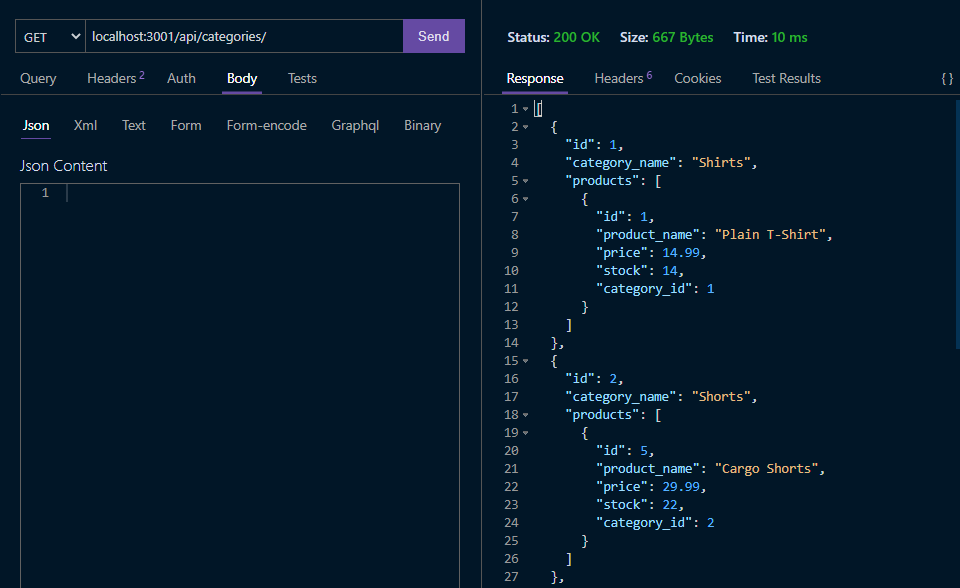    
   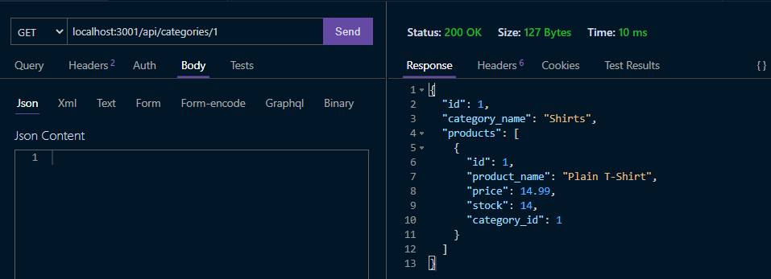
3. POST and PUT routes for Categoires   
   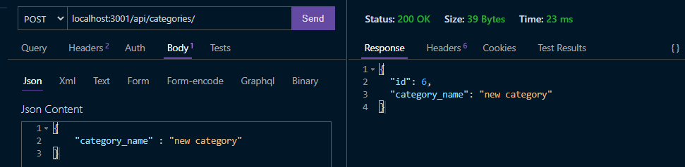   
   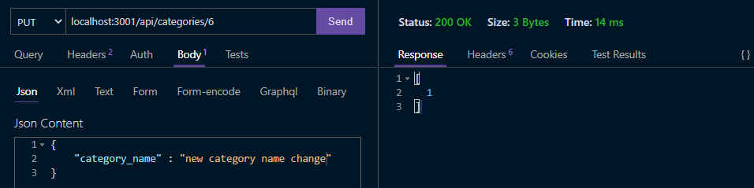   
4. DELETE routes for Categoires   
   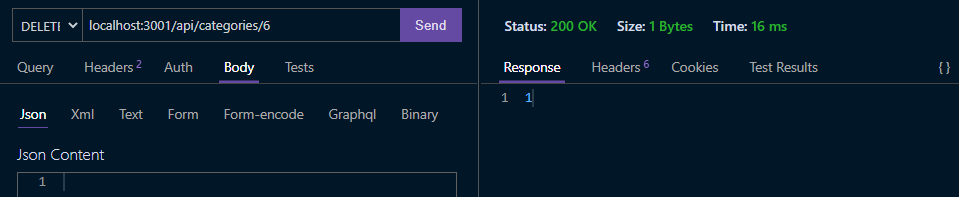
5. GET routes for Tags   
   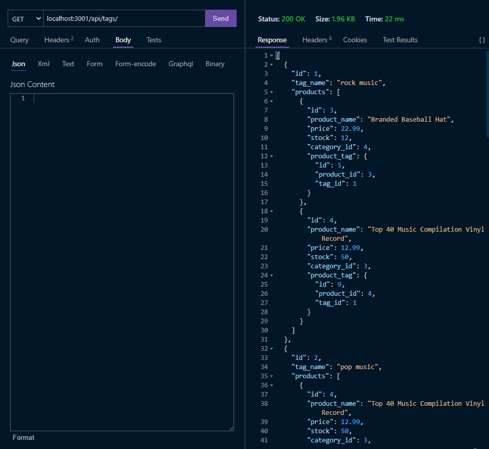   
   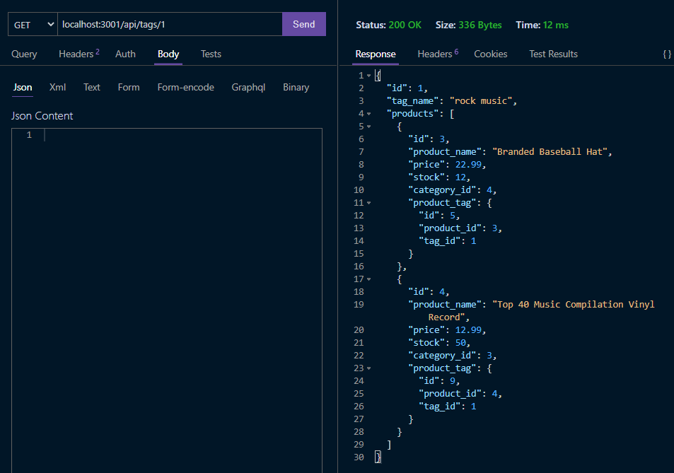    
6. POST and PUT routes for Tags   
   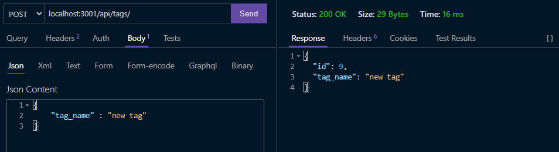   
   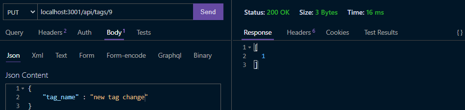   
7. DELETE routes for Tags   
   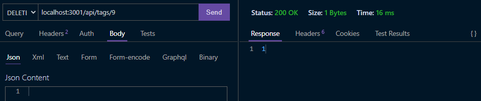
8. GET routes for Products   
   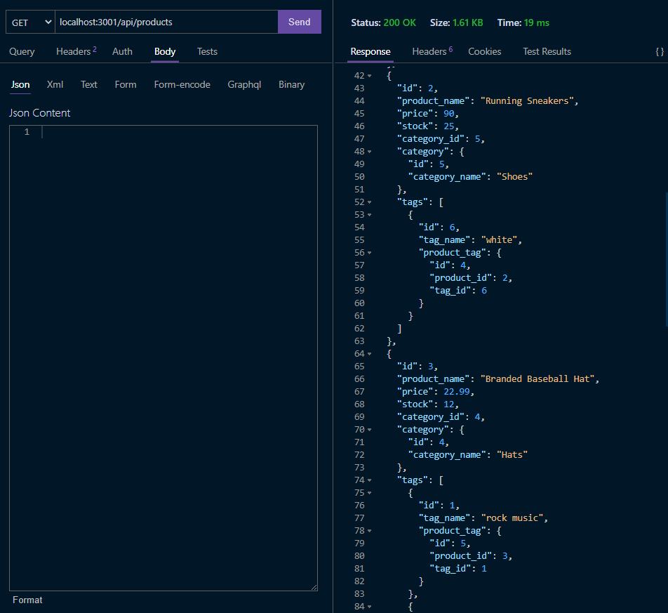   
   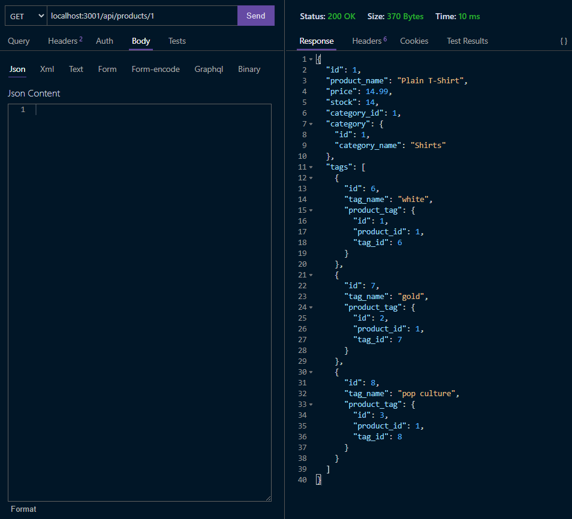    
9. POST and PUT routes for Products   
   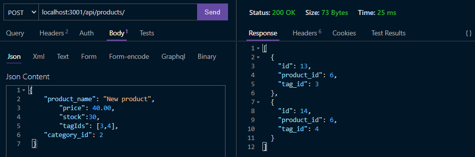   
   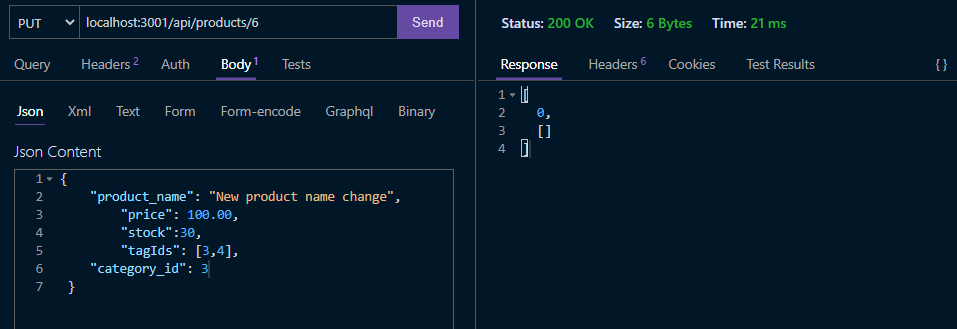
10. DELETE routes for Products   
    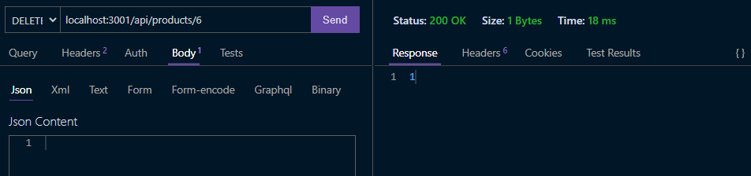

## Credits

N/A

## License

This application is under the MIT License  
For more information please view here: [MIT Description](https://choosealicense.com/licenses/mit/)

[](https://opensource.org/licenses/MIT)

## Contributions

Feel free to clone and improve on this application!

## Tests

[Demo Video](https://watch.screencastify.com/v/CY5A9teNaHf4ncx3IWFz)

## Questions

See more about my Github here: [Fchoi1](https://www.github.com/Fchoi1)  
Any burning questions you want to ask me?  
Reach out to me! [fwchoi@uwaterloo.ca](mailto:fwchoi@uwaterloo.ca)
